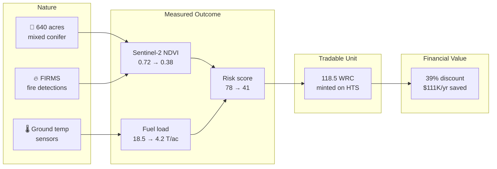
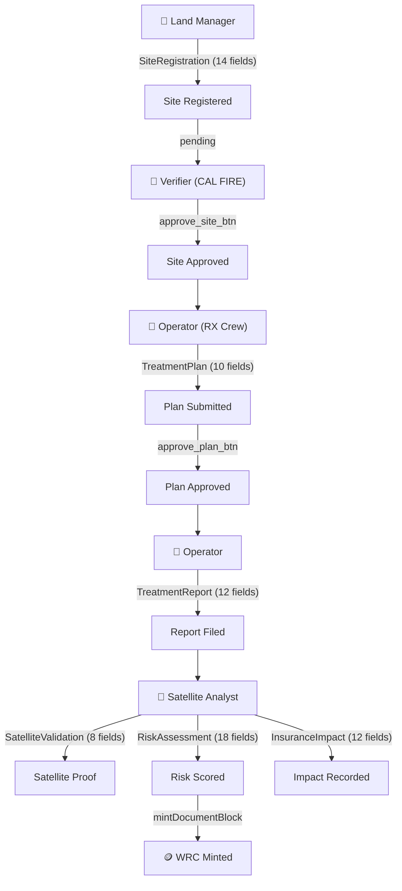

# Hestia

**A fire ledger for wildfire resilience.**

Hestia is an open-source platform that manages the full lifecycle of wildfire mitigation — from the moment a community registers a treatment site to the moment an insurer discounts their premium. Every activity produces a [Verifiable Credential](https://www.w3.org/TR/vc-data-model/) on [Hedera](https://hedera.com), every risk reduction is computed by on-chain smart contracts, and every treated acre mints a Wildfire Resilience Credit (WRC) that has real financial value.

The problem is simple: communities that proactively manage wildfire risk have no standardized way to prove it. The proof chain is fragmented across spreadsheets, inspector visits, satellite imagery, and phone calls. An insurer in New York can't verify that a prescribed burn in California actually happened, was properly contained, and reduced risk by the claimed amount.

Hestia makes every step auditable, traceable, and tradable.

## The Lifecycle of a Digital Environmental Asset

Every environmental asset follows a path from nature to financial value. Hestia implements this lifecycle end-to-end on Hedera:



This maps to the [UN SEEA](https://seea.un.org/) framework:
- **Stock accounts**: ecosystem extent (640 acres) and condition (mixed conifer, WUI density)
- **Flow accounts**: changes from treatment activities (fuel reduction, risk score change)
- **Monetary accounts**: financial value realized (insurance premium savings)

## Why This Matters

In 2024, [Tahoe Donner HOA](https://www.tahoedonner.com/) became the first homeowner association to secure a parametric wildfire insurance policy with a **39% lower premium** and **89% lower deductible**. This happened because they could prove 30+ years of forest health management. But the proof was messy — spreadsheets, photos, inspector reports with no chain of custody.

Hestia is what that proof system looks like when it runs on blockchain.

**Parametric insurance** means automatic payouts triggered by measurable events — no claims process, no adjusters, no delays. If NASA FIRMS detects 5+ fire hotspots within the insured boundary, `$2.5M` is released immediately with no restrictions on use. The [InsurancePremiumCalculator](https://hashscan.io/testnet/contract/0x751f5fD84e0eefc800a94734A386eAcEb9B745a9) contract on Hedera testnet computes this trigger in real time.

## Architecture

Hestia is a monorepo with five packages:

```
├── apps/web/                       Next.js 16 — guided 8-step flow + API routes
│   ├── src/app/hestia/              Landing page + flow entry
│   ├── src/app/api/hestia/
│   │   ├── guardian/                 Guardian REST proxy (submit, approve, query)
│   │   ├── contracts/                eth_call to deployed Solidity contracts
│   │   └── satellite/                NASA FIRMS + Sentinel-2 NDVI proxy
│   └── src/components/hestia/flow/   8 guided step components
│
├── guardian/                        Hedera Guardian dMRV policy
│   ├── schemas/                     6 Verifiable Credential schemas
│   ├── policies/                    Exported policy JSON
│   └── scripts/                     Python deployment + test scripts
│
├── packages/blockchain/             Hedera SDK — HCS, HTS, Mirror Node, KMS
├── packages/contracts/              Solidity smart contracts (Hardhat 2.22)
├── packages/satellite/              Python FastAPI — Sentinel-2 + FIRMS
└── packages/simulator/              OCEMS data generator
```

## Hedera Services

### Consensus Service (HCS)

Every Verifiable Credential produced by the Guardian is anchored to HCS topic [`0.0.8317430`](https://hashscan.io/testnet/topic/0.0.8317430). This provides an immutable, timestamped, ordered log of every action taken across the lifecycle — from site registration through token minting to insurance impact recording.

Each demo run produces **8+ HCS messages**, each resolvable to a unique [`CONSENSUSSUBMITMESSAGE` transaction on HashScan](https://hashscan.io/testnet/topic/0.0.8317430).

### Token Service (HTS)

WRC is a fungible token on Hedera Token Service: [`0.0.8312399`](https://hashscan.io/testnet/token/0.0.8312399) with 2 decimal places. **1 WRC = 1 verified treated acre.** When a satellite analyst confirms treatment completion and the risk model validates the reduction, the Guardian policy automatically mints WRC tokens proportional to the verified acreage.

A companion NFT token [`0.0.8312401`](https://hashscan.io/testnet/token/0.0.8312401) (CERT) is designed for containment certificates — digital proof that a prescribed burn was fully extinguished, inspired by [Cinderard](https://www.conservationxlabs.com/)'s ground temperature sensor concept from the Conservation X Labs Wildfire Challenge.

### Smart Contracts

Two Solidity contracts deployed on Hedera testnet, called via `eth_call` (pure functions — zero gas cost):

**[RiskScoreOracle](https://hashscan.io/testnet/contract/0x7FdC9d74419b60e5126585B586FFfba57a8934A3)** — `0x7FdC9d74419b60e5126585B586FFfba57a8934A3`

Computes a composite fire risk score from 6 independently measurable components:

| Component | Source | Weight |
|-----------|--------|--------|
| Fuel load | [LANDFIRE FBFM40](https://landfire.gov/) | 0–25 |
| Slope | Terrain DEM | 0–15 |
| WUI proximity | Structure density | 0–20 |
| Firefighter access | Road network distance | 0–10 |
| Fire history | [MTBS](https://www.mtbs.gov/) 20-year record | 0–10 |
| Weather | [NOAA/RAWS](https://raws.dri.edu/) | 0–20 |

```solidity
function calculateRisk(RiskComponents calldata c)
    external pure returns (uint8 total, string memory category)
// Categories: Low (≤25) · Moderate (26-50) · High (51-75) · Extreme (76-100)
```

**[InsurancePremiumCalculator](https://hashscan.io/testnet/contract/0x751f5fD84e0eefc800a94734A386eAcEb9B745a9)** — `0x751f5fD84e0eefc800a94734A386eAcEb9B745a9`

Converts WRC holdings into insurance premium discounts based on density (WRC per acre):

| Tier | Threshold | Discount | Tahoe Donner benchmark |
|------|-----------|----------|----------------------|
| Bronze | 10 WRC/acre | 10% | — |
| Silver | 25 WRC/acre | 25% | — |
| Gold | 50 WRC/acre | **39%** | ✓ Real-world equivalent |
| Platinum | 100 WRC/acre | 50% | — |

```solidity
function calculateSavings(uint256 annualPremiumCents, uint256 wrcBalance, uint32 acreage)
    external pure returns (uint256 savingsCents, uint16 discountBps, string memory tierName)

function checkParametricTrigger(uint8 firmsHotspots, uint8 threshold)
    external pure returns (bool triggered)
// 5+ FIRMS hotspots within boundary → automatic payout
```

### Guardian

Self-hosted Guardian 3.5.0 managing the complete VC lifecycle through a policy with **6 schemas**, **4 roles**, and **~50 workflow blocks**.



**Schemas:**
- `SiteRegistration` — GPS coordinates, acreage, WUI structure count, vegetation type, current risk score, insurer, annual premium, Hedera account
- `TreatmentPlan` — treatment type (prescribed burn / mechanical thinning / defensible space / fuel break), planned acres, dates, crew certification, burn permit, environmental clearance
- `TreatmentReport` — actual treated acres, fuel load before/after, reduction percentage, containment verification, ground temperature readings (Cinderard), photo documentation hash, crew lead signature
- `RiskAssessment` — pre/post 6-component risk scores, NDVI change, dNBR, FIRMS hotspot count, verified acres (= WRC mint amount), data sources, Sentinel-2 tile date, compliance flag, token action
- `SatelliteValidation` — Sentinel-2 tile date, NDVI value, NBR value, FIRMS detections, landcover classification, correlation score
- `InsuranceImpact` — pre/post risk, discount percentage, estimated annual savings, parametric trigger threshold, maximum payout, SEEA stock/flow/monetary classification

### Mirror Node

Real-time queries to `testnet.mirrornode.hedera.com` for:
- HCS message polling after each Guardian action (3s finality wait)
- Transaction ID resolution (consensus timestamp → transaction ID → HashScan URL)
- WRC token supply verification after minting

### Satellite Data

| Source | Endpoint | Resolution | What it proves |
|--------|----------|------------|----------------|
| [NASA FIRMS](https://firms.modaps.eosdis.nasa.gov/) | VIIRS active fire detections | 375m, near-real-time | Fire proximity to site, parametric trigger input |
| [Sentinel-2](https://sentinel.esa.int/web/sentinel/missions/sentinel-2) | NDVI + NBR vegetation indices | 10m, 5-day revisit | Pre/post treatment vegetation change — independent verification |
| [LANDFIRE](https://landfire.gov/) | FBFM40 fuel models | 30m | Fuel load baseline for risk component |
| [NOAA RAWS](https://raws.dri.edu/) | Fire weather stations | Station-based | Wind, relative humidity, temperature for weather risk |

## The Demo

The app walks through the complete lifecycle using **Tahoe Donner HOA** (Nevada County, California) — a real community with a 30+ year forest health management program.

Eight steps, four characters, one chain of proof:

| Step | Character | Role | What happens | Hedera evidence |
|------|-----------|------|-------------|-----------------|
| 1. Landscape | Raj Patel | Satellite Analyst | Surveys Sierra Nevada — FIRMS fire detection, 3D terrain, NDVI vegetation probes | Satellite data fetched live |
| 2. Community | Maria Chen | Land Manager (HOA) | Registers 640-acre site with on-chain risk score (78/100 Extreme) | `SiteRegistration` VC → HCS |
| 3. Inspection | Jennifer Torres | Verifier (CAL FIRE) | Reviews registration, cross-references with satellite NDVI, approves | `approve_site_btn` → HCS |
| 4. Plan | Carlos Martinez | Operator (RX Crew) | Selects prescribed burn, draws treatment polygon on map, submits | `TreatmentPlan` VC → HCS |
| 5. Work | Carlos Martinez | Operator | Reports 77% fuel reduction, 3-day burn timeline, Cinderard containment | `TreatmentReport` VC → HCS |
| 6. Proof | Raj Patel | Satellite Analyst | Live Sentinel-2 validation, on-chain risk computation (78→41), mints WRC | `SatelliteValidation` + `RiskAssessment` VCs + WRC mint → HCS |
| 7. Value | Maria Chen | Land Manager | On-chain insurance calculation, parametric trigger check, SEEA accounting | `InsuranceImpact` VC → HCS |
| 8. Chain | All four | — | Full trust chain: 7 VCs, 8+ HCS messages, all HashScan-linked | Aggregated provenance |

Every step creates a real Hedera testnet transaction. Every HashScan link resolves to a specific `CONSENSUSSUBMITMESSAGE`.

## Tech Stack

| Layer | Technology |
|-------|-----------|
| Frontend | [Next.js 16](https://nextjs.org/), React 19, TypeScript, [Tailwind CSS 4](https://tailwindcss.com/), [Mapbox GL JS 3](https://www.mapbox.com/mapbox-gljs), [Recharts](https://recharts.org/), [Framer Motion](https://www.framer.com/motion/) |
| Blockchain | [Hedera SDK 2.80](https://github.com/hashgraph/hedera-sdk-js), [ethers.js 6](https://docs.ethers.org/v6/), [Hardhat 2.22](https://hardhat.org/) |
| Guardian | [Hedera Guardian 3.5.0](https://github.com/hashgraph/guardian) (self-hosted, DigitalOcean) |
| Satellite | Python [FastAPI](https://fastapi.tiangolo.com/), [Google Earth Engine](https://earthengine.google.com/), [NASA FIRMS API](https://firms.modaps.eosdis.nasa.gov/api/) |
| Infrastructure | [Turborepo](https://turbo.build/), [Validation Cloud](https://www.validationcloud.io/) JSON-RPC relay |

## Getting Started

```bash
git clone https://github.com/akash-mondal/hestia.git
cd hestia
npm install
cp .env.example .env   # fill in your keys
npm run dev             # http://localhost:3001/hestia
```

Required environment variables (see `.env.example`):

| Variable | Purpose |
|----------|---------|
| `HEDERA_ACCOUNT_ID` | Hedera testnet operator account |
| `HEDERA_PRIVATE_KEY` | Operator private key (ED25519 or ECDSA) |
| `NEXT_PUBLIC_MAPBOX_TOKEN` | Mapbox GL JS public access token |
| `HEDERA_JSON_RPC_URL` | JSON-RPC relay for smart contract `eth_call` |

## Acknowledgments

This project draws on real-world wildfire mitigation research:
- [Conservation X Labs Wildfire Challenge](https://www.conservationxlabs.com/) — 12 innovations including ground temperature containment verification
- [Vibrant Planet](https://www.vibrantplanet.net/) — risk modeling platform and open data commons for fuel load and treatment planning
- [Tahoe Donner Association](https://www.tahoedonner.com/) — forest health management program demonstrating the insurance value of proactive mitigation

## License

[MIT](LICENSE)
