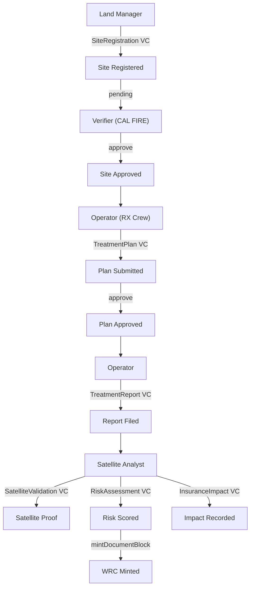

# Hestia

**A fire ledger for wildfire resilience.**

> **Live app:** [hestia.bond](https://hestia.bond) | **Guided demo:** [hestia.bond/hestia/app](https://hestia.bond/hestia/app)
>
> **Guardian UI:** [165.22.212.120:3000](http://165.22.212.120:3000) — Login: `akash` / `Akash@17327`
>
> **Source:** [github.com/akash-mondal/hestia](https://github.com/akash-mondal/hestia) — MIT License

---

## What is Hestia

Hestia records wildfire mitigation activities as Verifiable Credentials on Hedera and mints Wildfire Resilience Credits (WRC) that insurers accept for premium discounts. Every prescribed burn, every fuel reduction report, every satellite verification creates an immutable, auditable record on the Hedera ledger through Guardian.

The system follows a lifecycle: **Nature** (satellite imagery, ground sensors, fuel data) becomes a **Measured Outcome** (vegetation change, risk score reduction), which becomes a **Tradable Unit** (WRC tokens on HTS), which becomes **Financial Value** (insurance premium discount computed on-chain).

This maps to the [UN SEEA](https://seea.un.org/) framework: stock accounts (ecosystem extent) to flow accounts (treatment changes) to monetary accounts (premium savings).

## The Case Study

[Tahoe Donner HOA](https://www.tahoedonner.com/) (Nevada County, California) has managed their forests since 1992. In 2024, they secured parametric wildfire insurance with a **39% lower premium** and **89% lower deductible**. Parametric means if a fire hits, **$2.5M is released automatically** with no claims process and no restrictions on use. Hestia is the infrastructure that makes this proof scalable.

## Hedera Services

| Service | What we use it for | Testnet evidence |
|---------|-------------------|-----------------|
| **HCS** | Every Verifiable Credential anchored to consensus topic | [Topic 0.0.8317430](https://hashscan.io/testnet/topic/0.0.8317430) |
| **HTS** | WRC fungible token (1 WRC = 1 treated acre, 2 decimals) | [Token 0.0.8312399](https://hashscan.io/testnet/token/0.0.8312399) |
| **HTS** | CERT NFT for containment certificates | [Token 0.0.8312401](https://hashscan.io/testnet/token/0.0.8312401) |
| **Smart Contracts** | RiskScoreOracle: 6-component risk model (pure, zero gas) | [0x7FdC9d74419b60e5126585B586FFfba57a8934A3](https://hashscan.io/testnet/contract/0x7FdC9d74419b60e5126585B586FFfba57a8934A3) |
| **Smart Contracts** | InsurancePremiumCalculator: discount tiers + parametric trigger (pure, zero gas) | [0x751f5fD84e0eefc800a94734A386eAcEb9B745a9](https://hashscan.io/testnet/contract/0x751f5fD84e0eefc800a94734A386eAcEb9B745a9) |
| **Guardian** | dMRV policy engine: 6 schemas, 4 roles, ~50 workflow blocks | [Self-hosted 3.5.0](http://165.22.212.120:3000) |
| **Mirror Node** | HCS message polling, WRC supply verification, transaction resolution | `testnet.mirrornode.hedera.com` |

Both smart contracts are called via real `eth_call` through the Validation Cloud JSON-RPC relay. Pure functions, zero gas, anyone can verify.

## Guardian Policy

The Guardian policy manages the complete lifecycle of wildfire mitigation credentials.

**Schemas** (6): [`guardian/schemas/`](guardian/schemas/)
- SiteRegistration (14 fields) / TreatmentPlan (10) / TreatmentReport (12) / RiskAssessment (18) / SatelliteValidation (8) / InsuranceImpact (12)

**Roles** (4): Land Manager, Operator, Verifier, Satellite Analyst

**Policy workflow:**



**Guardian credentials:**

| Role | Username | Password | Purpose |
|------|----------|----------|---------|
| Standard Registry | `akash` | `Akash@17327` | Admin, policy management |
| Land Manager | `fresh_land` | `Test@12345` | Registers treatment sites |
| Operator | `fresh_oper` | `Test@12345` | Submits plans and reports |
| Verifier | `fresh_veri` | `Test@12345` | Approves registrations |
| Satellite Analyst | `fresh_sate` | `Test@12345` | Validates, assesses risk, mints WRC |

## Smart Contracts

Source code: [`packages/contracts/contracts/`](packages/contracts/contracts/)

**RiskScoreOracle** computes wildfire risk from six factors:

| Component | Data source | Weight |
|-----------|------------|--------|
| Fuel load | [LANDFIRE](https://landfire.gov/) FBFM40 | 0-25 |
| Slope | Terrain DEM | 0-15 |
| WUI proximity | Structure density | 0-20 |
| Firefighter access | Road network | 0-10 |
| Fire history | [MTBS](https://www.mtbs.gov/) 20yr record | 0-10 |
| Weather | [NOAA/RAWS](https://raws.dri.edu/) | 0-20 |

Total 0-100. Categories: Low (0-25), Moderate (26-50), High (51-75), Extreme (76-100).

**InsurancePremiumCalculator** converts WRC holdings to insurance discounts:

| Tier | WRC/Acre | Discount |
|------|----------|----------|
| Bronze | 10+ | 10% |
| Silver | 25+ | 25% |
| Gold | 50+ | 39% (Tahoe Donner benchmark) |
| Platinum | 100+ | 50% |

Also has `checkParametricTrigger(firmsHotspots, threshold)`: 5+ FIRMS detections in boundary triggers automatic $2.5M payout.

## Satellite Data

| Source | Data | Resolution |
|--------|------|-----------|
| [NASA FIRMS](https://firms.modaps.eosdis.nasa.gov/) | Active fire detections | 375m, near-real-time |
| [Sentinel-2](https://sentinel.esa.int/web/sentinel/missions/sentinel-2) | NDVI / NBR vegetation indices | 10m, 5-day revisit |
| [LANDFIRE](https://landfire.gov/) | Fuel models (FBFM40) | 30m |
| [NOAA RAWS](https://raws.dri.edu/) | Fire weather | Station-based |

Satellite API: [`packages/satellite/`](packages/satellite/)

## The Demo

The app at [hestia.bond/hestia/app](https://hestia.bond/hestia/app) walks through 8 steps with 4 characters. Each step creates a real Hedera transaction.

| Step | Who | What | Hedera action |
|------|-----|------|--------------|
| 1. Landscape | Raj (Satellite) | Survey Sierra Nevada, load FIRMS fires, fly to site | Data collection |
| 2. Community | Maria (HOA) | Register 640-acre site with on-chain risk score | SiteRegistration VC |
| 3. Inspection | Jennifer (CAL FIRE) | Cross-reference with satellite NDVI, approve | Site approval |
| 4. Plan | Carlos (RX Crew) | Draw treatment polygon, weather check, submit | TreatmentPlan VC |
| 5. Work | Carlos | 3-day burn, fuel slider, containment verification | TreatmentReport VC |
| 6. Proof | Raj | Live Sentinel-2 data, on-chain risk computation, mint WRC | SatelliteValidation + RiskAssessment VCs + WRC mint |
| 7. Value | Maria | On-chain insurance calc, parametric trigger, SEEA | InsuranceImpact VC |
| 8. Chain | All | Full trust chain, 7 VCs, all HashScan links | Provenance display |

Every HashScan link is a real `CONSENSUSSUBMITMESSAGE` transaction on testnet.

## Repository Structure

```
apps/web/                           Next.js 16 frontend
  src/app/hestia/                    Landing page + guided flow
  src/app/api/hestia/                API routes (Guardian, contracts, satellite)
  src/components/hestia/flow/        8 guided step components
  src/lib/hestia-*.ts                Server helpers, constants
  src/types/hestia.ts                Guardian schema TypeScript types

guardian/                            Hedera Guardian policy
  schemas/                           VC schema definitions
  scripts/                           Policy deployment + testing (Python)
  policies/                          Exported policy JSON

packages/contracts/                  Solidity smart contracts
  contracts/RiskScoreOracle.sol       6-component risk model
  contracts/InsurancePremiumCalculator.sol  Discount tiers + parametric trigger

packages/satellite/                  Python FastAPI satellite service
  api.py                             FIRMS + Sentinel-2 endpoints

packages/blockchain/                 Hedera SDK integration
  src/                               HCS, HTS, Mirror Node, KMS, trust chain
```

## Tech Stack

| Layer | Technology |
|-------|-----------|
| Frontend | Next.js 16, React 19, TypeScript, Tailwind CSS 4, Mapbox GL JS 3, Recharts, Framer Motion |
| Blockchain | Hedera SDK 2.80, ethers.js 6, Hardhat 2.22 |
| Guardian | v3.5.0, self-hosted on DigitalOcean |
| Satellite | Python FastAPI, Google Earth Engine, NASA FIRMS API |
| Infrastructure | Turborepo, Validation Cloud JSON-RPC |

## Getting Started

```bash
git clone https://github.com/akash-mondal/hestia.git
cd hestia && npm install
cp .env.example .env    # fill in keys
npm run dev             # http://localhost:3001/hestia
```

## Acknowledgments

- [Conservation X Labs Wildfire Challenge](https://www.conservationxlabs.com/) - ground temperature containment verification (Cinderard)
- [Vibrant Planet](https://www.vibrantplanet.net/) - risk modeling and open data commons
- [Tahoe Donner Association](https://www.tahoedonner.com/) - proving that proactive forest management has financial value

## License

[MIT](LICENSE)
