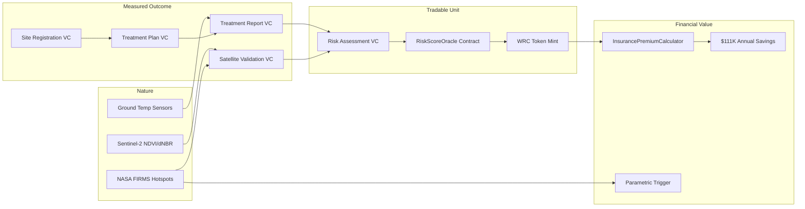
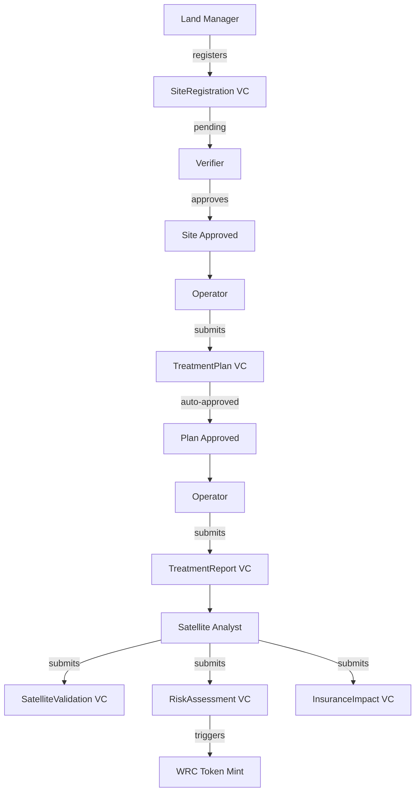

# Hestia — Wildfire Resilience Credits on Hedera

Hestia turns wildfire mitigation into verifiable, tradable digital assets. When a community clears fuel, burns prescriptively, or creates defensible space, Hestia records every step — from satellite imagery to ground temperature readings to insurance impact — as Verifiable Credentials on Hedera, then mints Wildfire Resilience Credits (WRC) that insurers accept for premium discounts.

Built for the [Hedera Hello Future Apex Hackathon 2026](https://hackathon.stackup.dev/web/events/hedera-hello-future-apex-hackathon-2026) — Sustainability Track.

## The Problem

The $41B 2025 Los Angeles wildfires proved that reactive firefighting has failed. Communities that proactively manage wildfire risk — like Tahoe Donner HOA, which secured a 39% lower premium through proven fuel reduction — have no standardized way to tokenize their mitigation work into tradable value. The proof chain is fragmented across spreadsheets, inspector reports, and satellite imagery with no single source of truth.

## How It Works



## Architecture

```
hestia/
├── apps/web/                    # Next.js 16 frontend
│   ├── src/app/hestia/          # Hestia pages (landing + 8-step flow)
│   ├── src/app/api/hestia/      # API routes (Guardian, contracts, satellite)
│   ├── src/components/hestia/   # Flow components (8 guided steps)
│   ├── src/lib/hestia-*.ts      # API helpers, constants
│   └── src/types/hestia.ts      # Guardian schema types
├── guardian/                    # Hedera Guardian policy
│   ├── policies/                # Policy JSON exports
│   ├── schemas/                 # 6 VC schemas
│   └── scripts/                 # Deployment & test scripts
├── packages/
│   ├── blockchain/              # Hedera SDK integration (HCS, HTS, KMS)
│   ├── contracts/               # Solidity smart contracts (Hardhat)
│   ├── satellite/               # Python satellite API (Sentinel-2, FIRMS)
│   └── simulator/               # OCEMS data generator
└── scripts/                     # E2E pipeline tests
```

## Hedera Services Used

| Service | Usage | Evidence |
|---------|-------|---------|
| **HCS** (Consensus) | Every Verifiable Credential is anchored to HCS topic `0.0.8317430` | [HashScan](https://hashscan.io/testnet/topic/0.0.8317430) |
| **HTS** (Token) | WRC fungible token (`0.0.8312399`, 2 decimals) — 1 WRC = 1 verified treated acre | [HashScan](https://hashscan.io/testnet/token/0.0.8312399) |
| **Smart Contracts** | `RiskScoreOracle` + `InsurancePremiumCalculator` — pure functions called via `eth_call` | [Contract 1](https://hashscan.io/testnet/contract/0x7FdC9d74419b60e5126585B586FFfba57a8934A3) · [Contract 2](https://hashscan.io/testnet/contract/0x751f5fD84e0eefc800a94734A386eAcEb9B745a9) |
| **Guardian** | dMRV policy with 6 schemas, 4 roles, ~50 blocks — manages full VC lifecycle | Self-hosted on DigitalOcean |
| **Mirror Node** | Real-time HCS message polling, WRC supply verification, transaction resolution | `testnet.mirrornode.hedera.com` |

## Guardian Policy Design



**Roles**: Land Manager · Operator · Verifier · Satellite Analyst
**Schemas**: SiteRegistration (14 fields) · TreatmentPlan (10) · TreatmentReport (12) · RiskAssessment (18) · SatelliteValidation (8) · InsuranceImpact (12)

## Smart Contracts

### RiskScoreOracle (`0x7FdC...A3`)

6-component risk model: fuel load (LANDFIRE), slope (terrain), WUI proximity, firefighter access, fire history (MTBS), weather (NOAA). Pure function — free to call.

```solidity
function calculateRisk(RiskComponents calldata c)
    external pure returns (uint8 total, string memory category)
```

### InsurancePremiumCalculator (`0x751f...a9`)

WRC-to-discount tier mapping + parametric trigger detection.

| Tier | WRC/Acre | Discount |
|------|----------|----------|
| Bronze | 10+ | 10% |
| Silver | 25+ | 25% |
| Gold | 50+ | 39% |
| Platinum | 100+ | 50% |

```solidity
function calculateSavings(uint256 premiumCents, uint256 wrcBalance, uint32 acreage)
    external pure returns (uint256 savingsCents, uint16 discountBps, string memory tierName)

function checkParametricTrigger(uint8 firmsHotspots, uint8 threshold)
    external pure returns (bool triggered)
```

## Satellite Data Sources

| Source | Data | Resolution | Usage |
|--------|------|-----------|-------|
| NASA FIRMS | Active fire detections | 375m, near-real-time | Fire proximity analysis, parametric triggers |
| Sentinel-2 | NDVI, NBR vegetation indices | 10m, 5-day revisit | Pre/post treatment verification |
| LANDFIRE | Fuel models (FBFM40) | 30m | Fuel load baseline for risk scoring |
| NOAA/RAWS | Fire weather (wind, RH, temp) | Station-based | Weather risk component |

## Demo: Tahoe Donner Case Study

The app demonstrates the full lifecycle using Tahoe Donner HOA (Nevada County, CA) — a real community that became the first HOA to secure parametric wildfire insurance in 2024.

**8-step guided flow:**
1. **Landscape** — Satellite reconnaissance with 3D terrain, FIRMS fire columns, NDVI probes
2. **Community** — Site registration with on-chain risk score computation
3. **Inspection** — Verifier approval with satellite cross-reference
4. **Plan** — Treatment planning with polygon drawing and weather window check
5. **Work** — Treatment report with 3-day burn timeline and containment verification
6. **Proof** — Risk assessment with live Sentinel-2 data + on-chain risk computation → WRC minting
7. **Value** — Insurance impact with on-chain discount calculation + parametric trigger status
8. **Chain** — Full trust chain with 7+ HashScan-linked Verifiable Credentials

Every step creates a real Hedera transaction. Every HashScan link points to a specific `CONSENSUSSUBMITMESSAGE` on testnet.

## Tech Stack

- **Frontend**: Next.js 16, React 19, TypeScript, Tailwind CSS 4, Mapbox GL JS 3, Recharts, Framer Motion
- **Blockchain**: Hedera SDK 2.80, ethers.js 6, Hardhat 2.22
- **Guardian**: v3.5.0, self-hosted (DigitalOcean), REST API
- **Satellite**: Python FastAPI, Google Earth Engine, NASA FIRMS API
- **Infrastructure**: Turborepo monorepo, Validation Cloud JSON-RPC relay

## Getting Started

```bash
# Install dependencies
npm install

# Set environment variables (see .env.example)
cp .env.example .env

# Run development server
npm run dev

# Navigate to http://localhost:3001/hestia
```

## Environment Variables

See `.env.example` for required variables. Key ones:
- `HEDERA_ACCOUNT_ID` / `HEDERA_PRIVATE_KEY` — Hedera testnet operator
- `NEXT_PUBLIC_MAPBOX_TOKEN` — Mapbox GL access token
- `HEDERA_JSON_RPC_URL` — Validation Cloud endpoint for contract calls

## License

MIT
