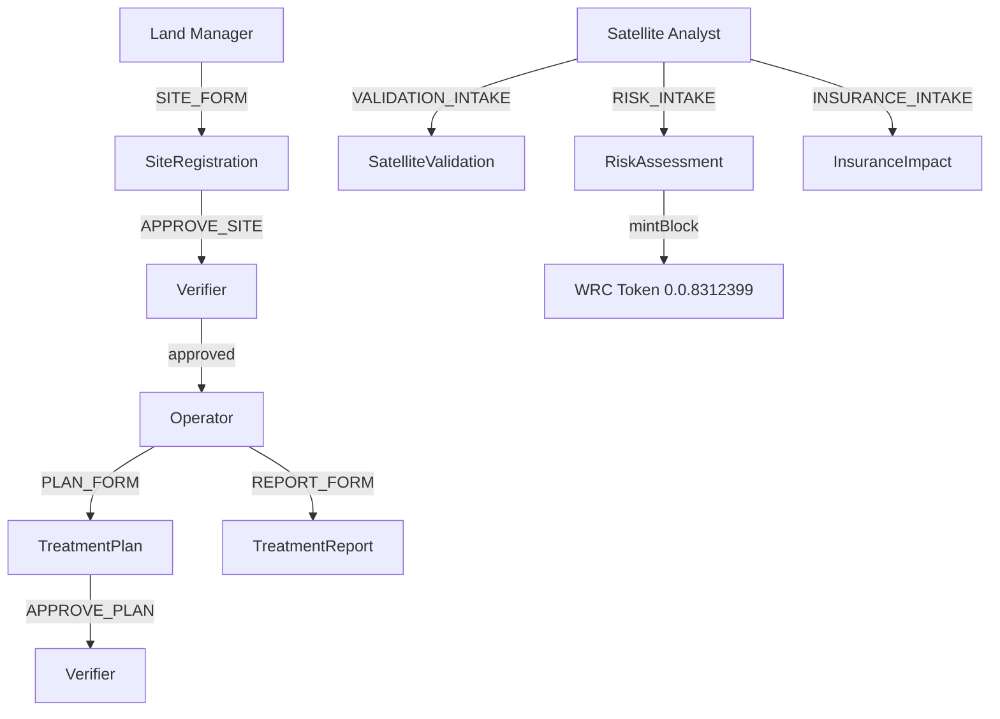

# Guardian dMRV Policy

Self-hosted Guardian 3.5.0 on DigitalOcean (`165.22.212.120`). Policy ID: `69be7aa85056e1c7a8d8fea8`.

## Policy Architecture



## Schemas (6)

| Schema | Fields | Role |
|--------|--------|------|
| SiteRegistration | 14 (siteId, coords, acres, WUI, vegetation, risk, insurer) | Land Manager |
| TreatmentPlan | 10 (type, acres, dates, crew, permits) | Operator |
| TreatmentReport | 12 (fuel load, containment, temps, crew lead) | Operator |
| SatelliteValidation | 8 (NDVI, NBR, FIRMS, landcover, correlation) | Satellite |
| RiskAssessment | 18 (6 risk components, pre/post, mint amount) | Satellite |
| InsuranceImpact | 12 (discount, savings, SEEA, parametric) | Satellite |

## Tags

```
SITE_FORM, PLAN_FORM, REPORT_FORM, RISK_INTAKE, VALIDATION_INTAKE, INSURANCE_INTAKE
APPROVE_SITE, APPROVE_PLAN, REJECT_SITE, REJECT_PLAN
PENDING_SITES, PENDING_PLANS, RISK_GRID, REPORTS_GRID, MONITOR_GRID, MY_SITES, INSURANCE_GRID
```

## Scripts

- `deploy-selfhosted.py` — Deploys policy with all schemas, blocks, tokens
- `test-dry-run.py` — E2E test with Tahoe Donner demo data
- `middleware-compliance.py` — Compliance evaluation middleware
