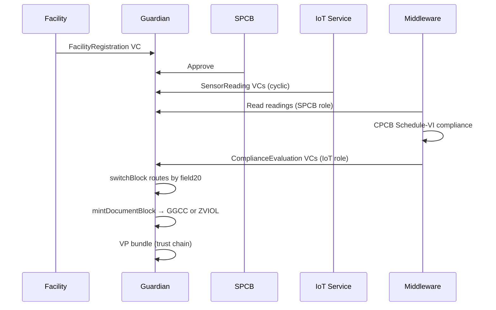

# Guardian dMRV Policy

Self-hosted Guardian 3.5.0 on DigitalOcean (`165.22.212.120`). Published v1.0.0.

Full dMRV lifecycle: facility registration → SPCB approval → sensor readings → compliance evaluation → token minting → trust chain.

## Pipeline



Compliance evaluation runs in middleware. switchBlock routes results: compliant → mint GGCC (fungible), violation → mint ZVIOL (NFT). mintDocumentBlock creates VP bundles linking evaluation → token for trust chain drill-down.

## 51 Blocks, 4 Roles

| Role | Workflow |
|------|----------|
| **Facility** | Register (17-field VC), view readings, view tokens |
| **SPCB** | Approve/reject registrations, monitor readings grid, evaluations grid |
| **VVB** | Review flagged violations, satellite validation data |
| **IoT** | Submit sensor readings + compliance evaluations (cyclic) |

## Schemas

| Schema | Fields | IRI |
|--------|--------|-----|
| FacilityRegistration | 17 | `#4446ea1a-...&1.0.0` |
| SensorReading | 16 | `#71192499-...&1.0.0` |
| ComplianceEvaluation | 21 | `#cc56ae96-...&1.0.0` |
| SatelliteValidation | 7 | `#939b3017-...&1.0.0` |

## Tokens

| Token | ID | Type |
|-------|----|------|
| GGCC (Green Ganga Compliance Credit) | `0.0.8182260` | Fungible |
| ZVIOL (Zeno Violation Record) | `0.0.8182266` | NFT |

## Scripts

```bash
python3 guardian/scripts/deploy-selfhosted.py     # Full deploy (schemas + blocks)
python3 guardian/scripts/update-blocks.py --dry-run # Block-only update + dry-run
python3 guardian/scripts/test-dry-run.py            # E2E: register → approve → 5 readings → 5 evaluations → mint
python3 guardian/scripts/middleware-compliance.py    # One-shot compliance evaluation
```

## Key Implementation Details

- switchBlock conditions are **mathjs formula expressions** evaluated against VC credentialSubject scope: `"field20 == 'mint_ggcc'"`, not field+value objects
- switchBlock has `ChildrenType.None` — routes to mint blocks via **events**, not children
- mintDocumentBlock uses `tokenId` directly (no template needed) with `rule: "1"`
- `requestVcDocumentBlock` is the only block that accepts data via tag API POST
- `interfaceStepBlock` with `cyclic=True` enables repeated submissions
- Dry-run `PUT /dry-run` needs no body and no Content-Type header
