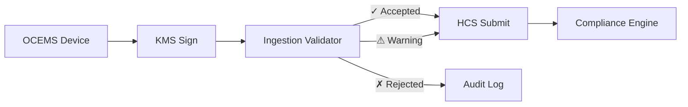
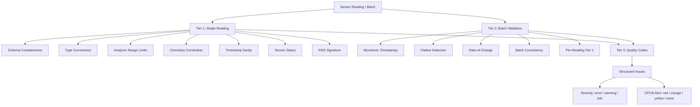

# @zeno/blockchain — Ingestion Validator

Production-grade OCEMS sensor data validation layer matching real CPCB architecture. This layer sits between data ingestion and HCS submission — no invalid data reaches the blockchain.

**This layer is considered stable.** Validation rules are derived from official CPCB guidelines and protocols.

---

## Architecture



### Three-Tier Validation



---

## Validation Rules

### Tier 1: Single Reading

#### Schema & Type Checks
| Check | Rule | Severity |
|-------|------|----------|
| Required fields | All 17 fields must be present | error |
| Numeric types | pH, BOD, COD, TSS, etc. must be valid numbers | error |
| Sensor status | Must be: online, offline_queued, reconnected_batch, maintenance, calibrating | error |
| KMS signature | kmsSigHash and kmsKeyId must be non-empty | error |

#### Analyzer Range Limits
Based on CPCB-approved OCEMS analyzer specifications. Values beyond these ranges are instrument errors.

| Parameter | Min | Max | Source |
|-----------|-----|-----|--------|
| pH | 0 | 14 | Analyzer spec |
| BOD | 0 | 400 mg/L | Analyzer spec |
| COD | 0 | 1000 mg/L | Analyzer spec |
| TSS | 0 | 1000 mg/L | Analyzer spec |
| Temperature | -10 | 60°C | Analyzer spec |
| Total Chromium | 0 | 50 mg/L | Physical limit |
| Hex. Chromium | 0 | 10 mg/L | Physical limit |
| Oil & Grease | 0 | 200 mg/L | Physical limit |
| Ammoniacal N | 0 | 500 mg/L | Physical limit |
| Dissolved Oxygen | 0 | 20 mg/L | Physical limit (saturation) |
| Flow | 0 | 100,000 KLD | Practical limit |

#### Chemistry Constraints
| Constraint | Rule | Why |
|-----------|------|-----|
| COD > BOD | COD measures ALL organics, BOD only biodegradable | Fundamental — COD is superset of BOD |
| BOD/COD ratio 0.1–0.8 | Below 0.1 = toxic waste or miscalibration. Above 0.8 = unusual for industrial. | Catches calibration drift |
| Hex Cr ≤ Total Cr | Hexavalent is a subset of Total Chromium | If hex > total, sensor is broken |

#### Timestamp Sanity
| Check | Rule | Severity |
|-------|------|----------|
| Future timestamp | > now + 1 minute | error |
| Stale timestamp | > 24 hours old | warning |
| Invalid format | Not ISO 8601 parseable | error |

#### Calibration / Maintenance Awareness
| Status | Behavior |
|--------|----------|
| `calibrating` | Accepted with `CALIBRATION_MODE` info — not for compliance evaluation |
| `maintenance` | Accepted with `MAINTENANCE_MODE` info — not for compliance evaluation |
| `online` | Normal validation |
| `offline_queued` | Normal validation (buffered during connectivity loss) |
| `reconnected_batch` | Normal validation (reconnection upload) |

### Tier 2: Batch Validation

#### Batch Structure
| Check | Rule | Severity |
|-------|------|----------|
| Required fields | facilityId, batchId, windowStart, windowEnd, readingCount, readings | error |
| Non-empty readings | readings array must have ≥1 entry | error |
| Max batch size | ≤15 readings per 15-minute window | warning |
| Reading count match | readingCount must equal readings.length | warning |
| Facility ID consistency | All readings must share the batch's facilityId | error |
| Window bounds | Window must be ≤16 minutes, not inverted | warning/error |

#### Flatline Detection
Per CPCB August 2025 Online Automated Alerts Generation Protocol:

- **Rule**: If a parameter shows <5% variation across all readings in a batch, flag as potential tampering
- **Excluded**: pH (per CPCB protocol — pH can legitimately be stable)
- **Severity**: warning (maps to CPCB Yellow Alert Level I)
- **Note**: Full 48-hour flatline detection (Yellow → Orange → Red escalation) is handled by the AI agent layer, not the ingestion validator

#### Rate-of-Change Limits
Maximum allowed change between consecutive 1-minute readings. Values beyond these indicate sensor malfunction or tampering (CPCB rejects "impossible jumps").

| Parameter | Max Change/Minute |
|-----------|-------------------|
| pH | 2.0 units |
| BOD | 50 mg/L |
| COD | 150 mg/L |
| TSS | 100 mg/L |
| Temperature | 5°C |
| Total Chromium | 1.0 mg/L |
| Hex. Chromium | 0.5 mg/L |
| Oil & Grease | 10 mg/L |
| Ammoniacal N | 20 mg/L |
| Dissolved Oxygen | 5 mg/L |

#### Timestamp Ordering
Readings within a batch must have monotonically increasing timestamps (each reading after the previous one).

---

## CPCB Alert Level Mapping

The validator maps each issue to the CPCB August 2025 tiered alert protocol:

| Alert Level | Meaning | Validator Triggers |
|-------------|---------|-------------------|
| **Red** | Critical — stop discharge | Missing fields, invalid types, future timestamps, empty KMS signature, below analyzer min |
| **Orange** | Serious — notify SPCB/CPCB | Above analyzer max, COD<BOD, HexCr>TotalCr, non-monotonic timestamps |
| **Yellow** | Warning — corrective action | Stale timestamps, flatline, rate-of-change exceeded, BOD/COD ratio out of range, batch size/count issues |
| **None** | Informational | Calibration mode, maintenance mode |

---

## Quality Codes Reference

| Code | Severity | Alert | Description |
|------|----------|-------|-------------|
| `INVALID_TYPE` | error | red | Input is not an object |
| `MISSING_FIELD` | error | red | Required field not present |
| `INVALID_NUMERIC` | error | red | Numeric field is not a number |
| `BELOW_ANALYZER_MIN` | error | red | Value below analyzer minimum range |
| `ABOVE_ANALYZER_MAX` | error | orange | Value above analyzer maximum range |
| `COD_LESS_THAN_BOD` | error | orange | Violates fundamental chemistry |
| `BOD_COD_RATIO_LOW` | warning | yellow | Ratio <0.1 — toxic waste or miscalibration |
| `BOD_COD_RATIO_HIGH` | warning | yellow | Ratio >0.8 — unusual for industrial |
| `HEX_CR_EXCEEDS_TOTAL` | error | orange | Hex Cr is subset of Total Cr |
| `INVALID_TIMESTAMP` | error | red | Cannot parse timestamp |
| `FUTURE_TIMESTAMP` | error | red | Timestamp ahead of server time |
| `STALE_TIMESTAMP` | warning | yellow | Timestamp >24 hours old |
| `INVALID_SENSOR_STATUS` | error | red | Unknown sensor status value |
| `CALIBRATION_MODE` | info | none | Reading during calibration |
| `MAINTENANCE_MODE` | info | none | Reading during maintenance |
| `EMPTY_KMS_SIGNATURE` | error | red | Missing KMS signature hash |
| `EMPTY_KMS_KEY_ID` | error | red | Missing KMS key identifier |
| `INVALID_BATCH_TYPE` | error | red | Batch input is not an object |
| `MISSING_BATCH_FIELD` | error | red | Required batch field missing |
| `READINGS_NOT_ARRAY` | error | red | readings is not an array |
| `EMPTY_BATCH` | error | red | Batch has no readings |
| `READING_COUNT_MISMATCH` | warning | yellow | readingCount ≠ readings.length |
| `BATCH_TOO_LARGE` | warning | yellow | >15 readings in batch |
| `WINDOW_TOO_WIDE` | warning | yellow | Window spans >15 minutes |
| `WINDOW_INVERTED` | error | red | windowEnd before windowStart |
| `FACILITY_ID_MISMATCH` | error | red | Reading facilityId ≠ batch facilityId |
| `TIMESTAMP_NOT_MONOTONIC` | error | orange | Readings not in chronological order |
| `RATE_OF_CHANGE_EXCEEDED` | warning | yellow | Impossible jump between readings |
| `FLATLINE_DETECTED` | warning | yellow | <5% variation — potential tampering |

---

## Running the Tests

```bash
cd zeno
npx tsx packages/blockchain/scripts/test-validator.ts
```

96 tests covering:
- Schema completeness and type checking
- All analyzer range limits (upper and lower)
- All chemistry constraints (COD>BOD, BOD/COD ratio, HexCr≤TotalCr)
- Timestamp sanity (future, stale, invalid format)
- Sensor status handling (calibrating, maintenance, offline)
- KMS signature presence
- Batch structure and consistency
- Flatline detection with pH exclusion
- Rate-of-change detection (pH jumps, COD jumps)
- Timestamp ordering within batches
- Per-reading validation within batches
- Quality codes and CPCB alert level mapping
- Legacy wrapper compatibility
- 1000-reading stress test (2ms)
- COD>BOD invariant stress test (1000 readings)
- Edge cases (zero flow, boundary values)

---

## References

- CPCB Revised OCEMS Guidelines August 2018 (Sections 5.4.4, 5.4.5)
- CPCB Online Automated Alerts Generation Protocol August 2025
- CPCB Revised OCEMS Calibration Protocol July 2025
- OCEMS Analyzer Specifications: pH ±1%, COD/BOD/TSS ±5%, Temp ±0.5°C
- CPCB Data Quality Codes and Rejection Criteria (cems.cpcb.gov.in)
