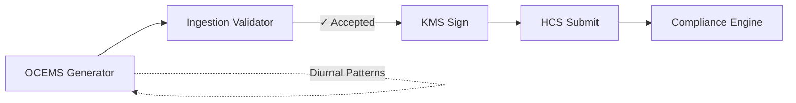
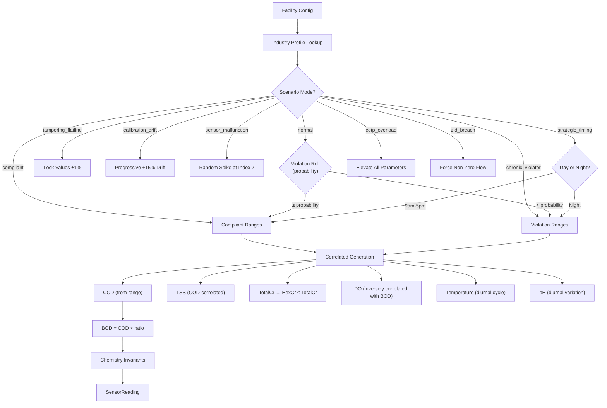

# @zeno/simulator — OCEMS Data Generator

Production-grade OCEMS sensor data generator producing regulatory-authentic effluent readings for India's Grossly Polluting Industries. This generator is the data source for the entire Zeno pipeline — every reading flows through validation, HCS submission, compliance evaluation, and token minting.

**This layer is considered stable.** All parameter ranges are derived from real CPCB data, CETP performance reports, and NGT orders.

---

## Architecture



### Generation Pipeline



---

## Industry-Specific Profiles

Each of the 17 CPCB industry categories has a profile with realistic treated effluent ranges. Six industries have detailed profiles based on real data; the rest use a calibrated default.

### Tanneries (Kanpur Jajmau Data)

Based on real Jajmau CETP performance data (2023-2025):
- Raw inlet: BOD 3,600 / COD 7,200 / Cr 270 / TSS 3,600 mg/L
- CETP outlet (compliant): BOD 15-28 / COD 80-230 / Cr 0.3-1.8 mg/L
- CETP outlet (overloaded): BOD 35-120 / COD 280-500 / Cr 2.5-8.0 mg/L
- Problem parameters: COD, Total Chromium, BOD, TSS
- BOD/COD ratio: 0.25-0.45 (low biodegradability from chrome tanning)

### Distillery (ZLD Mandated)

- ZLD mandated by CPCB since 2014 — zero discharge is the only compliant state
- Violation = any liquid discharge (flow > 0 KLD)
- Raw spent wash: BOD 40,000-50,000 / COD 80,000-100,000 mg/L
- Problem parameters: Flow (any discharge), BOD, COD, pH

### Pharma

- API wash waters cause periodic COD spikes
- Low chromium (not a pharma issue)
- BOD/COD ratio: 0.15-0.35 (low biodegradability from API residues)
- Problem parameters: COD, pH, Ammoniacal Nitrogen

### Pulp & Paper

- Highest water consumption (500-5,000 KLD per facility)
- Black liquor leakage causes alkaline pH spikes (9.5-11.0)
- BOD/COD ratio: 0.3-0.5 (moderate biodegradability)
- Problem parameters: COD, BOD, TSS, pH

### Dye & Dye Intermediates

- Chrome dyes contribute to chromium discharge
- Recalcitrant organics resist biodegradation → very low BOD/COD ratio (0.1-0.25)
- Acid dye bath discharge causes extreme pH drops (2.5-4.5)
- Problem parameters: COD, pH, Total Chromium

### Sugar

- Seasonal operation, molasses-based BOD
- Highly biodegradable effluent → high BOD/COD ratio (0.4-0.6)
- Problem parameters: BOD, COD

---

## Correlated Parameter Generation

Parameters are NOT generated independently. The generator enforces real-world correlations:

| Relationship | Implementation |
|-------------|----------------|
| COD > BOD (always) | BOD derived from COD × industry-specific ratio. Hard-clamped. |
| BOD/COD ratio | Industry-specific: 0.1-0.25 (dye) to 0.4-0.6 (sugar) |
| HexCr ≤ TotalCr (always) | HexCr generated after TotalCr, clamped if exceeding |
| TSS correlates with COD | TSS baseline multiplied by COD deviation factor |
| DO inversely correlates with BOD | High BOD → low dissolved oxygen (organic load depletes O₂) |
| Temperature follows diurnal cycle | Sine wave peaking at 14:00, trough at 02:00 |
| pH has slight diurnal variation | Rises slightly at night (reduced microbial activity) |

---

## Scenario Modes

Named scenarios for demo and testing. Each produces a specific pattern identifiable by the AI agent and regulators.

| Scenario | What It Produces | CPCB Detection |
|----------|-----------------|----------------|
| `normal` | Mixed compliant/violation per facility probability | — |
| `compliant` | All readings within discharge limits | — |
| `chronic_violator` | Always exceeds limits on 2-3 parameters | Red/Orange alert |
| `tampering_flatline` | Values locked to ±1% variation (pH excluded) | Yellow Alert Level I |
| `calibration_drift` | Values drift upward 0-15% over batch | Detectable via trend analysis |
| `sensor_malfunction` | Sudden impossible spike at reading index 7 | Orange alert (impossible jump) |
| `strategic_timing` | Compliant 9am-5pm, violating at night | AI agent pattern detection |
| `zld_breach` | ZLD facility with non-zero discharge | Immediate Red alert |
| `cetp_overload` | All parameters elevated 1.3-1.5× | Multiple parameter warnings |

---

## Diurnal Patterns

The generator models real-world temporal patterns:

- **Temperature**: Follows ambient temperature cycle (Kanpur, March baseline 28°C, ±4°C amplitude). Peaks at 14:00, lowest at 02:00. Process heat adds on top.
- **pH**: Slight rise at night (+0.3 pH units peak) due to reduced microbial CO₂ production.
- **Sensor status**: 93% online, 2% maintenance, 2% calibrating, 2% offline_queued, 1% reconnected_batch.

---

## Batch Generation

`generateBatch()` produces a 15-minute window of readings:
- 15 readings at 1-minute intervals (CPCB standard)
- Monotonically increasing timestamps
- Inter-reading drift (small variation between consecutive readings)
- All drift magnitudes well within rate-of-change limits
- Facility ID consistent across all readings in batch

`generateTimeSeries()` produces multiple consecutive batches:
- Each batch starts 15 minutes after the previous
- Suitable for generating 24h of data (96 batches × 15 readings = 1,440 readings)

---

## Facilities

10 pre-configured facilities covering 5 industry types:

| ID | Name | Industry | Discharge Mode | Violation % |
|----|------|----------|----------------|-------------|
| KNP-TAN-001 | Superhouse Leather | Tanneries | discharge | 50% |
| KNP-TAN-002 | Mirza Tanners | Tanneries | discharge | 30% |
| KNP-TAN-003 | Rahman Industries | Tanneries | discharge | 40% |
| KNP-TAN-004 | Pioneer Tannery | Tanneries | discharge (strict CTO) | 60% |
| KNP-TAN-005 | Kanpur Chrome Tanning | Tanneries | discharge | 35% |
| KNP-DST-001 | UP Distillers | Distillery | ZLD | 20% |
| KNP-PHA-001 | Omega Pharma | Pharma | discharge | 25% |
| UNN-PPR-001 | Ganges Paper Mills | Pulp & Paper | discharge | 30% |
| KNP-DYE-001 | Ganga Dyes & Chemicals | Dye | discharge | 35% |
| KNP-TAN-006 | Bharat Leather Works | Tanneries | discharge | 10% |

**KNP-TAN-004** has CTO custom limits (near Ganga drinking water intake): BOD ≤ 20, COD ≤ 150, Cr ≤ 1.0.

---

## Running the Tests

```bash
cd zeno
npx tsx packages/simulator/scripts/test-generator.ts
```

113 tests covering:
- Basic single reading generation (7 tests)
- Chemistry invariants: COD > BOD, HexCr ≤ TotalCr (2,000 + 5,000 + 5,000 readings)
- Analyzer range limits (1,000 readings)
- Industry-specific profiles: Tannery, Distillery ZLD, Pharma, Pulp & Paper, Dye (6 test groups)
- All scenario modes: compliant, chronic_violator, tampering_flatline, calibration_drift, sensor_malfunction, zld_breach, cetp_overload (7 scenarios)
- Batch structure: timestamps, intervals, facility consistency, window bounds
- Rate-of-change limits (100 batches × 15 readings × 10 parameters = 14,000 pairs)
- Time-series generation (4 batches, 60 readings)
- Diurnal temperature variation
- CTO custom limits
- All 10 facilities generate valid readings
- Edge cases: forced violation, forced compliant, custom timestamps, single-reading batch
- Performance: 1,000 readings in 1ms, 100 batches in 1ms, 24h time-series in 1ms
- Schema completeness (17 required fields)
- Batch-validator compatibility (facilityId, readingCount, window bounds)
- Multi-facility parallel generation

---

## References

- CPCB General Standards for Discharge of Environmental Pollutants (Schedule-VI)
- CPCB CETP Performance Report, Kanpur Jajmau Cluster (2023-2025)
- NGT Order on Kanpur Tanneries — ₹2.37 crore penalty on 211 units (2024)
- CPCB August 2025 Online Automated Alerts Generation Protocol
- CPCB Directions for 17 GPI Categories — mandatory OCEMS installation
- CPCB ZLD Mandate for Distilleries (2014)
- OCEMS Analyzer Specifications: pH ±1%, COD/BOD/TSS ±5%, Temp ±0.5°C
